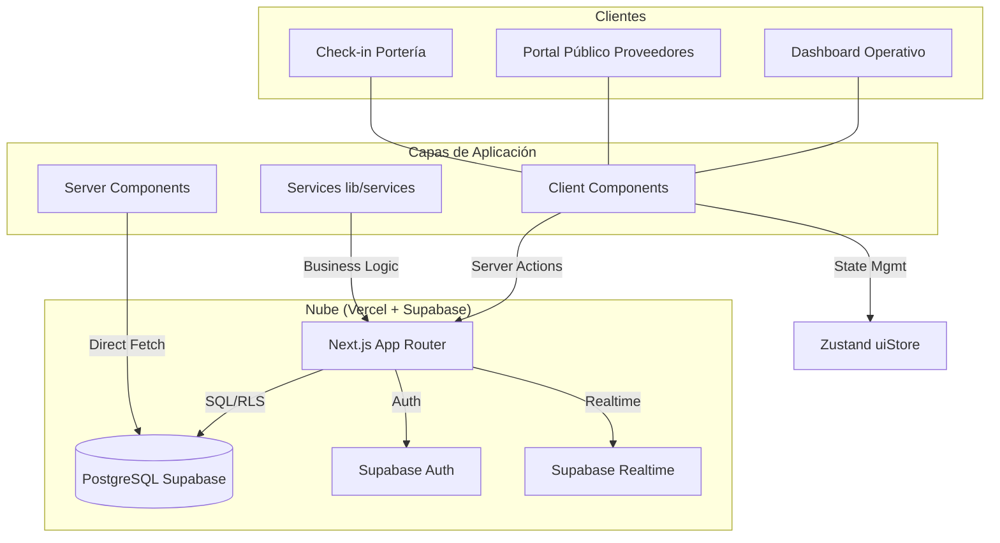
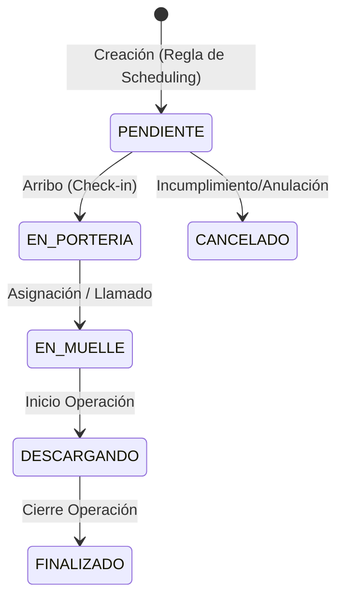
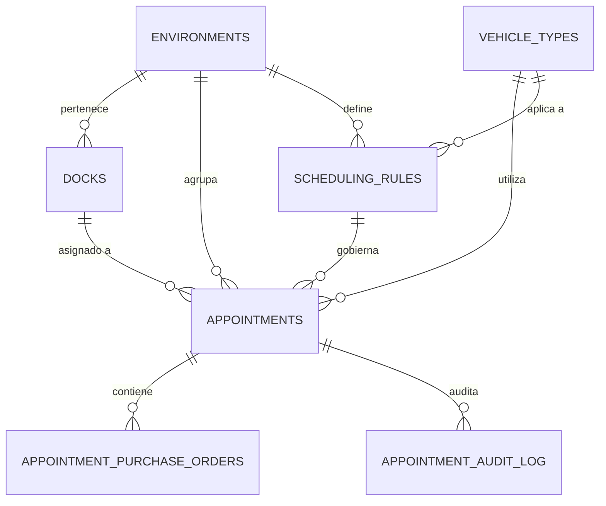

# Documento Técnico Maestro: MasterIsimo CEDI (YMS) 🏗️

Este documento consolida la arquitectura, el diseño de la base de datos, los contratos de API y los algoritmos críticos del sistema de gestión de patio (Yard Management System) MasterIsimo.

---

## 1. Arquitectura de Sistemas y Flujo de Datos

MasterIsimo utiliza una arquitectura **Server-First** sobre Next.js 15, optimizada para la resiliencia operativa y la seguridad de los datos.

### A. Diagrama de Arquitectura de Alto Nivel


### B. Ciclo de Vida y Trazabilidad de la Cita
Las transiciones de estado disparan automáticamente el registro de marcas de tiempo (timestamps) para KPI de productividad.



---

## 2. Esquema de Base de Datos (Supabase)

El sistema opera sobre un modelo relacional estricto con políticas de **Row Level Security (RLS)** para proteger los datos de diferentes ambientes y roles.

### A. Diagrama Entidad-Relación (ER)


### B. Diccionario de Tablas Críticas

| Tabla | Propósito | Claves / Restricciones |
| :--- | :--- | :--- |
| `appointments` | Corazón del sistema, almacena el estado y tiempos de la cita. | PK: `id` (UUID), unique: `appointment_number` |
| `docks` | Muelles físicos del CEDI. | PK: `id`, FK: `environment_id` |
| `scheduling_rules` | Define duraciones y reglas por cajas/vehículo. | PK: `id`, priorizada por campo `priority` |
| `capacity_limits` | Límites de cajas por día y ambiente. | PK: `id`, unique: `environment_id` |

---

## 3. Motor de Agendamiento (Scheduling Engine)

El motor de agendamiento es una pieza de lógica determinista ejecutada exclusivamente en el servidor.

### A. Resolución de Reglas
1. **Match Exacto:** Filtra por `environment_id` + `vehicle_type_id` + rango de cajas.
2. **Cascada de Prioridad:** Selecciona la regla con el `priority` más bajo.
3. **Puntos de Extensión:** Si `is_dynamic` es verdadero, aplica lógica de interpolación.

### B. Algoritmo de Cálculo de Duración (LERP)
Para reglas dinámicas con un rango de cajas definido (`min_boxes` a `max_boxes`) y tiempos (`duration_minutes` a `max_duration_minutes`):

$$ \text{Tiempo} = \text{T}_{\text{base}} + \frac{(\text{Cajas}_{\text{solicitadas}} - \text{Cajas}_{\text{min}}) \times (\text{T}_{\text{max}} - \text{T}_{\text{min}})}{\text{Cajas}_{\text{max}} - \text{Cajas}_{\text{min}}} $$

### C. Búsqueda de Slots (Slotting)
1. Filtra **Muelles Compatibles** por tipo (DESCARGUE/MIXTO) y tipo de vehículo soportado.
2. Identifica **Bloques Ocupados** en `appointments` para la fecha dada.
3. Escanea el rango operativo (según `cedi_settings` y `capacity_limits`) en saltos de 30 minutos.
4. Retorna slots donde al menos un muelle compatible esté libre durante **toda** la duración calculada.

---

## 4. Contratos de API y Estructura del Frontend

### A. Proyecciones (Pattern: Low Payload)
Se utilizan interfaces estrictas para evitar el over-fetching de datos en vistas masivas:

```typescript
interface KanbanAppointmentRow {
  id: string;
  status: AppointmentStatus;
  license_plate: string;
  dock_id: number | null;
  // ... campos reducidos (80% menos payload)
}
```

### B. Panel de Muelles (Timeline)
- **Tecnología:** React + Tailwind CSS + Zustand.
- **Gestión de Colisiones:** El Timeline renderiza bloques de tiempo basados en `scheduled_time` y `scheduled_end_time`. La lógica de validación garantiza que no existan solapamientos en un mismo muelle físico mediante la función `checkDockAvailability`.

---

## 5. Protocolo de Trazabilidad y Auditoría

Cada cambio en una cita se registra en dos niveles:
1. **Timestamping:** Campos directos en `appointments` (`arrival_time`, `docking_time`, etc.).
2. **Audit Log:** La tabla `appointment_audit_log` almacena un diff JSON del cambio, el usuario responsable y el timestamp de la acción.

---

> [!TIP]
> Para resolver conflictos de superposición, el motor siempre prioriza las citas ya confirmadas. Si se requiere un "Forzado de Muelle", el sistema registra el `force_reason` en la auditoría para garantizar transparencia operativa.
