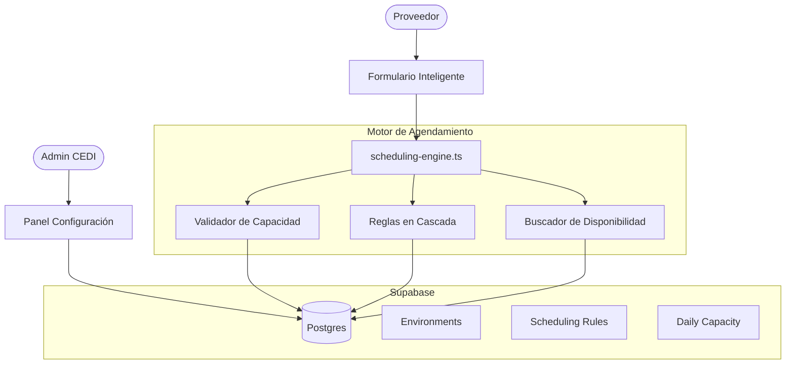
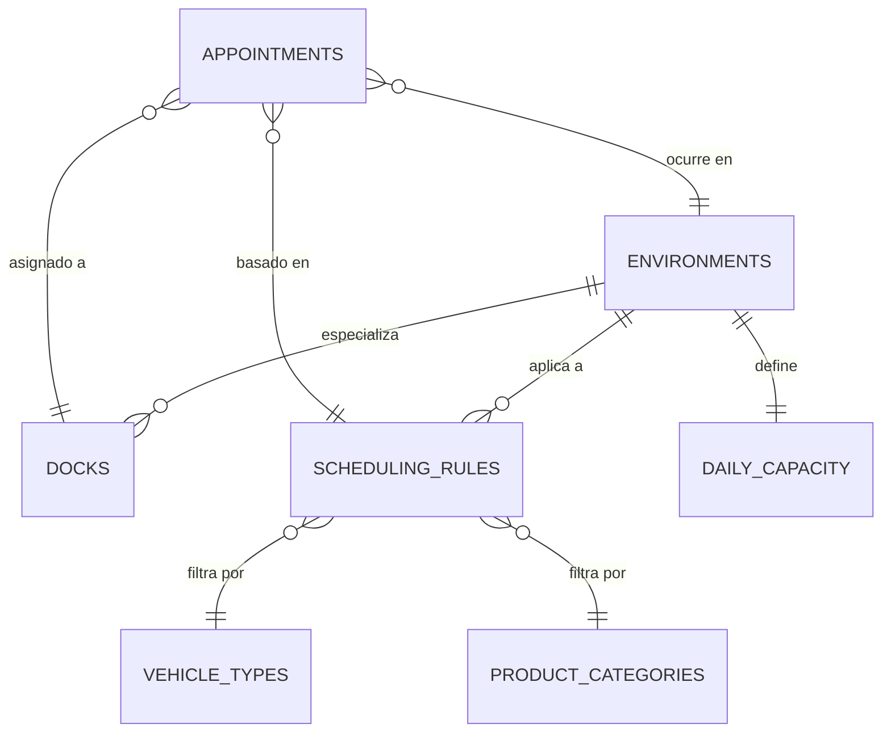

# Guía de Arquitectura: MasterIsimo CEDI 🏗️

Este documento detalla la estructura técnica, los flujos de datos y el modelo operativo del Motor de Agendamiento Inteligente de MasterIsimo.

## 1. Visión General del Sistema

El sistema utiliza **Next.js 15** con el **App Router** y **Supabase** como backend. La lógica de negocio está centralizada en servicios desacoplados para garantizar consistencia entre el formulario público y el dashboard interno.

### Diagrama de Arquitectura (Motor de Reglas)

---

## 2. El Motor de Agendamiento (Core Logic)

El motor (`scheduling-engine.ts`) automatiza la asignación de citas mediante un proceso de 3 pasos:

### Paso 1: Validación de Capacidad (Soft Limits)
El sistema verifica el volumen total de cajas proyectado para la fecha y ambiente seleccionados.
- **Normal Limit:** Si se supera, se marca para Horario Extendido.
- **Extended Limit:** Si se supera, se genera una alerta de Sobrecupo Crítico.
*Nota: El motor nunca bloquea la cita, permitiendo flexibilidad operativa bajo alerta.*

### Paso 2: Resolución de Reglas Logísticas
Se busca la regla de duración más específica en la base de datos siguiendo este orden de prioridad:
1. **Ambiente** (Secos, Fríos, etc.)
2. **Categoría de Producto** (Fruver, Bebidas, etc.)
3. **Tipo de Vehículo** (Tractocamión, Turbo, etc.)
4. **Rango de Cajas** (Min/Max)

### Paso 3: Búsqueda de Slots en Muelles Compatibles
Identifica muelles que:
- Estén marcados con el ambiente solicitado.
- Soporten el tipo de vehículo.
- Tengan un bloque de tiempo continuo disponible equivalente a la duración calculada.

---

## 3. Modelo de Datos (ERD Actualizado)

---

## 4. Filosofía Operativa: "Soft Limits & Visibility"

A diferencia de sistemas rígidos, MasterIsimo prioriza la **visibilidad sobre el bloqueo**:
1. **Agendamiento:** Siempre es posible agendar, pero el sistema informa al usuario y al CEDI sobre el estado de la capacidad.
2. **Dashboard Real-time:** Los supervisores ven barras de progreso que cambian de color (🟢 a 🔴) permitiendo tomar decisiones proactivas antes de que lleguen los vehículos.
3. **Asignación Forzada:** El personal interno tiene la facultad de sobrescribir cualquier regla del motor mediante "Asignación Forzada", registrando siempre el motivo para trazabilidad.

---
*Ultima actualización: Abril 2026 - Integración de Motor Inteligente*
