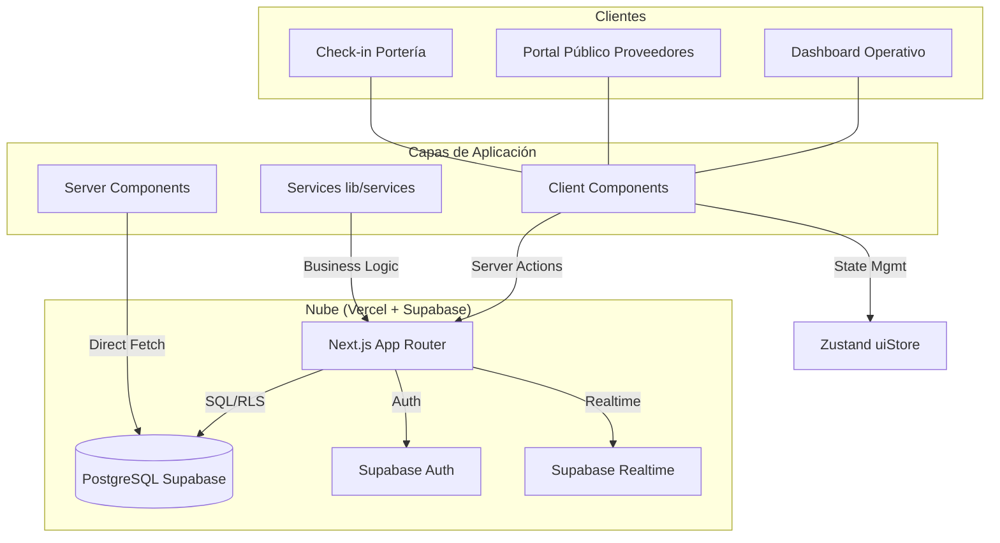
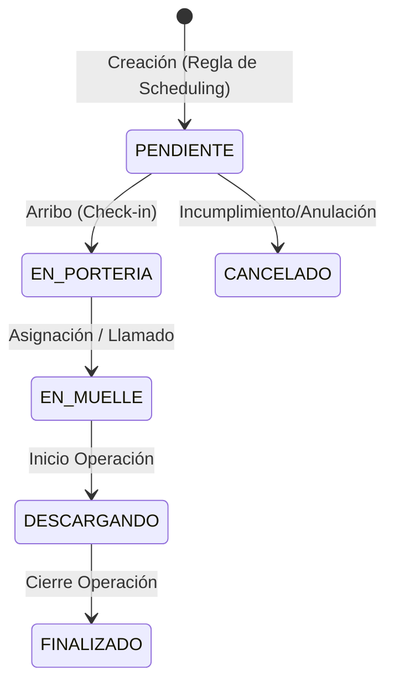

# Guía de Arquitectura Técnica (v3.1) 🏗️

Este documento detalla la implementación técnica avanzada del YMS, centrada en el rendimiento, la seguridad y la escalabilidad de Next.js 15.

## 1. Arquitectura de Sistemas y Flujo de Datos

MasterIsimo utiliza una arquitectura **Server-First** sobre Next.js 15, optimizada para la resiliencia operativa y la seguridad de los datos.

### A. Diagrama de Arquitectura de Alto Nivel

### B. Ciclo de Vida y Trazabilidad de la Cita
Las transiciones de estado disparan automáticamente el registro de marcas de tiempo (timestamps).

---

## 2. Capa de Servicios (`lib/services`)

La lógica de acceso a datos se ha desacoplado de la UI para garantizar consistencia y facilitar el mantenimiento.

1. **`scheduling-engine.ts`**: Orquestación logística y resolución de slots.
2. **`appointments.ts`**: Implementa el patrón **Projections**. Define tipos como `KanbanAppointmentRow` que contienen solo los campos necesarios, reduciendo el payload de red hasta en un 80%.

---

## 3. Integración con Supabase

MasterIsimo utiliza tres canales de comunicación:
- **Server Client (SSR/Actions)**: Para lectura pesada y mutaciones protegidas.
- **Browser Client**: Para autenticación y lógica volátil de cliente.
- **Realtime (WebSockets)**: Sincronización instantánea de estados entre todos los usuarios del dashboard.

---

## 4. Estado Global (Zustand)

Se utiliza `useUIStore` para desacoplar la interactividad compleja:
- **Gestión de Modales**: El store almacena la entidad seleccionada (e.g., `selectedAppointment`) y controla la apertura/cierre de los paneles de detalle para evitar el *prop-drilling*.
- **Configuración de UI**: Estados del Sidebar y alertas globales.

> [!IMPORTANT]
> Aunque el store gestione la "entidad activa" para la UI, el **Estado de Negocio** se sincroniza directamente con Supabase mediante Server Actions o suscripciones en tiempo real. El store nunca sustituye a la base de datos como fuente primaria de datos persistentes.
