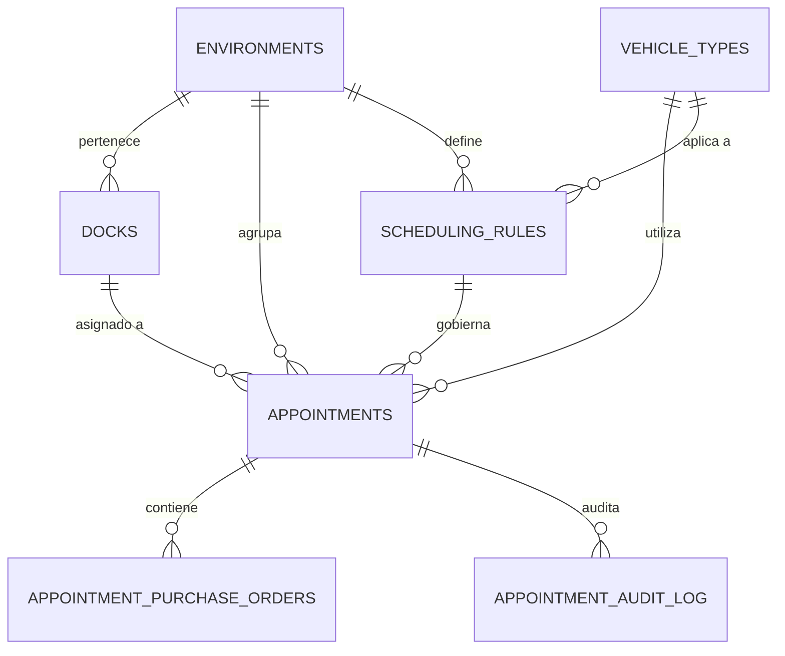

Este documento mapea la estructura de la base de datos PostgreSQL (Supabase) con el sistema de tipado estricto en TypeScript.

## 0. Modelo Relacional (Diagrama ER)

## 1. Esquema de Base de Datos (Core Tables)

### `environments`
Define los sectores operativos del CEDI.
- `id` (int4): PK.
- `name` (text): Código interno.
- `display_name` (text): Nombre legible (Secos, Fríos).
- `color` (text): Color hexadecimal para UI.
- `icon` (text): Nombre del icono de Material Symbols.

### `scheduling_rules`
Reglas de negocio que alimentan el motor.
- `id` (int4): PK.
- `environment_id` (int4): FK → environments.
- `vehicle_type_id` (int4): FK → vehicle_types.
- `category_id` (int4): FK → product_categories.
- `min_boxes` (int4): Umbral mínimo de cajas.
- `max_boxes` (int4): Umbral máximo (para LERP/Filtro).
- `duration_minutes` (int4): Tiempo base de descarga.
- `is_dynamic` (bool): Habilitar interpolación matemática.
- `priority` (int4): Prioridad de resolución (Menor = Superior).

### `appointments`
Registro central de operaciones.
- `id` (uuid): PK.
- `scheduled_date` (date): Fecha de la cita.
- `scheduled_time` (time): Hora inicio.
- `scheduled_end_time` (time): Hora fin calculada.
- `status` (enum): PENDIENTE, EN_PORTERIA, EN_MUELLE, DESCARGANDO, FINALIZADO, CANCELADO.
- `box_count` (int4): Cajas totales reportadas.
- `environment_id` (int4): FK → environments.
- `dock_id` (int4): FK → docks.

---

## 2. Tipos de TypeScript y Proyecciones

Para garantizar el rendimiento **"Zero Over-fetching"**, el sistema utiliza proyecciones granulares en lugar de descargar el objeto completo en cada vista.

### Proyección: `KanbanAppointmentRow`
*Vía: `lib/services/appointments.ts`*
- **Propósito:** Tablero Kanban real-time.
- **Campos:** `id`, `status`, `license_plate`, `company_name`, `dock_name`, `arrival_time`, `purchase_orders`.
- **Payload:** ~75% más ligero que un `select(*)`.

### Proyección: `TimelineAppointmentRow`
*Vía: `lib/services/appointments.ts`*
- **Propósito:** Vista de línea de tiempo por muelles.
- **Campos:** `id`, `dock_id`, `scheduled_time`, `scheduled_end_time`, `status`.

---

## 3. Mapeo de Estados (Workflow)

El estado se gestiona mediante el enum `AppointmentStatus`, con transiciones automáticas que disparan timestamps de trazabilidad:

| Estado | Evento | Campo Postgres |
| :--- | :--- | :--- |
| `EN_PORTERIA` | Al hacer Check-in | `arrival_time` |
| `EN_MUELLE` | Al asignar/llegar a muelle | `docking_time` |
| `DESCARGANDO` | Inicio de operación | `start_unloading_time` |
| `FINALIZADO` | Entrega completada | `end_unloading_time` |

> [!TIP]
> Use siempre `buildStatusTransitionUpdates()` en `lib/services/appointments.ts` para realizar cambios de estado, garantizando que los timestamps de trazabilidad se generen correctamente.
